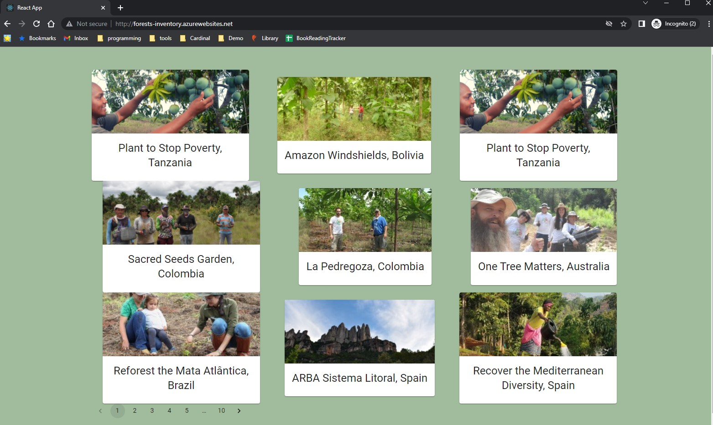

# Sample Forest Inventory Application
A simple react and flask app to display information about forests

## Flask App
This is my first python-based API. I used SQLAlchemy as an ORM. If I had more time I would like to add a testing framework around this as well.
To run just the backend you can run `pip install requirements.txt` and then `python base.py`

## React App
The react app was bootstrapped with create-react-app and styled using material-ui.
To run just the front end you can run `npm install` and then `npm start`
I would have liked to make the cards sized consistently

## Deployment
To run with docker locally run: `docker build -f Dockerfile -t forest-inventory .`
Then run: `docker run --rm -p 8003:8003 forest-inventory` and open a browswer to http://localhost:8003/
The website is deployed to [http://forests-inventory.azurewebsites.net/]http://forests-inventory.azurewebsites.net/

